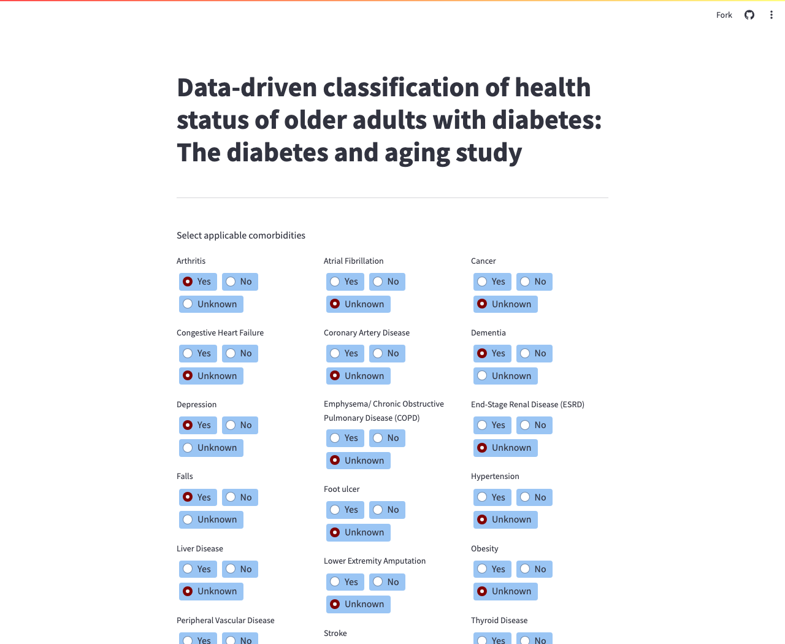
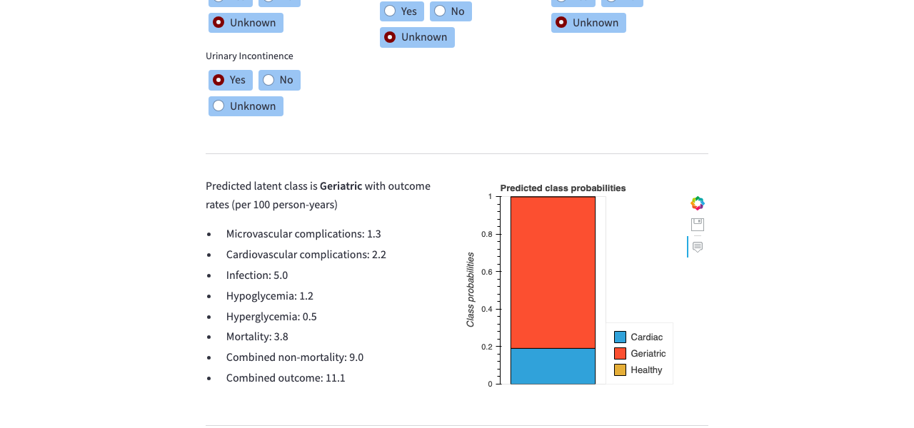
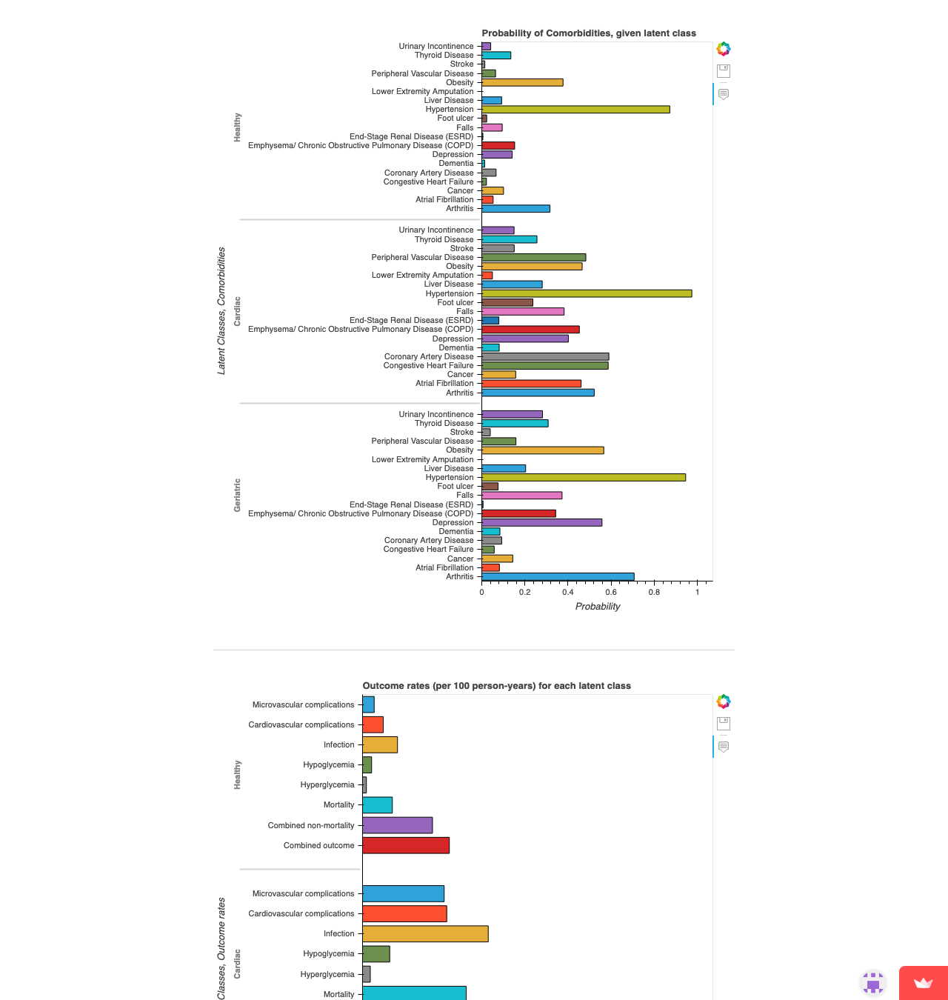

# LCA Class Membership & Outcome Probability Calculator

[](https://lca-class-probability-calculator.streamlit.app/)

**[Live Demo](https://lca-class-probability-calculator.streamlit.app/)**

A Streamlit web app for computing **Latent Class Analysis (LCA)** class membership probabilities and outcome rates based on user-selected covariate values.

The live demo is pre-loaded with model weights from a study on data-driven health status classification of older adults with diabetes ([docs/Diabetes_Latent_Class_Predictions.pdf](docs/Diabetes_Latent_Class_Predictions.pdf)). It classifies patients into three latent classes — Geriatric, Cardiac, and Healthy — based on 19 comorbidities (e.g., depression, congestive heart failure, dementia) and reports predicted outcome rates (microvascular/cardiovascular complications, infection, hypoglycemia, mortality) per 100 person-years.

Given a fitted LCA model (prior class probabilities, covariate–class probability estimates, and outcome rates), this tool lets users interactively select observed covariates and instantly see:

- The **predicted latent class** and its outcome rates
- A **bar chart of class membership probabilities**
- **Covariate probability profiles** for each latent class
- **Outcome rates** across all classes

### Select comorbidities



### Predicted class and outcome rates



### Covariate profiles and outcome rate charts



## How It Works

The app implements the standard LCA posterior probability formula:

$$P(j \mid x_{obs}) = \frac{\hat{\eta}_j \prod_{i=1}^{P} [\hat{\pi}_{ij}^{x_i} (1 - \hat{\pi}_{ij})^{1 - x_i}]^{r_i}}{\sum_{k=1}^{K} \hat{\eta}_k \prod_{i=1}^{P} [\hat{\pi}_{ik}^{x_i} (1 - \hat{\pi}_{ik})^{1 - x_i}]^{r_i}}$$

where covariates can be marked as **Yes**, **No**, or **Unknown** (unobserved covariates are excluded from the product).

## Quick Start

1. **Install dependencies:**

   ```bash
   pip install -r requirements.txt
   ```

2. **Configure your LCA model** by editing `config.yaml` (see `config-sample.yaml` for the expected format):

   ```yaml
   Study Name:
     covariate_label: "Conditions"
     prior_probabilities:
       class_1: 0.3
       class_2: 0.4
       class_3: 0.3
     covariate_class_probabilities:
       covariate_1: [0.8, 0.2, 0.1]
       covariate_2: [0.1, 0.7, 0.3]
     outcome_rates:
       outcome_1: [0.9, 0.05, 0.05]
     outcome_rate_unit: "per 100 person-years"
   ```

3. **Run the app:**

   ```bash
   streamlit run app.py
   ```

## Configuration

All model parameters are defined in `config.yaml`:

| Key | Description |
|-----|-------------|
| `covariate_label` | Display label for covariates (e.g., "Conditions", "Symptoms") |
| `prior_probabilities` | Prior class membership probabilities (one per class) |
| `covariate_class_probabilities` | Probability of each covariate given class membership |
| `outcome_rates` | Outcome rates for each class |
| `outcome_rate_unit` | Unit label for outcome rates (e.g., "per 100 person-years") |

## License

Apache License 2.0 — see [LICENSE](LICENSE) for details.
